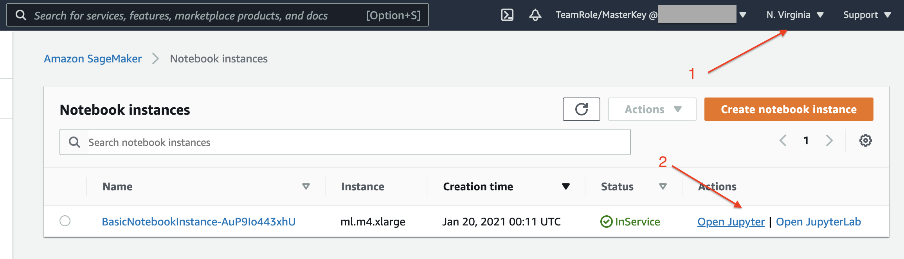
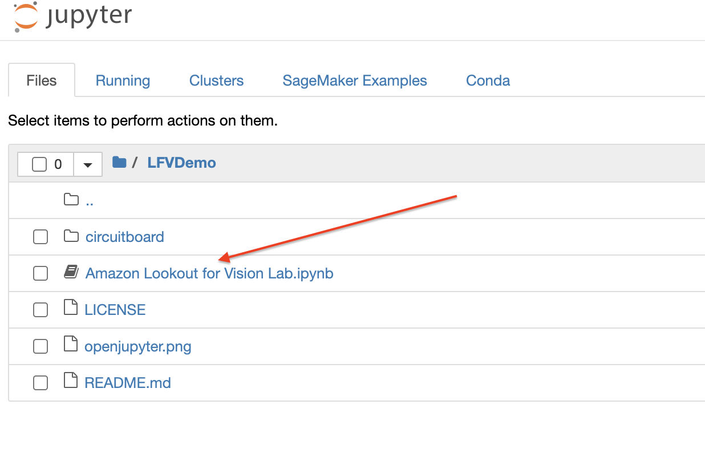

# Lookout for Vision Workshop

Amazon Lookout for Vision is a machine learning (ML) service that spots defects and anomalies in visual representations using computer vision (CV). With Amazon Lookout for Vision, manufacturing companies can increase quality and reduce operational costs by quickly identifying differences in images of objects at scale. This workshop is intended to run through an end to end example of using the boto3 python SDK to train and host Lookout for Vision models. For a console-only getting started guide, see https://docs.aws.amazon.com/lookout-for-vision/latest/developer-guide/getting-started.html

## Steps:

1. Launch this cloudformation template - 
(Make sure you are in us-east-1)

2. Navigate to SageMaker on your AWS console and click Notebook instances on the side menu

3. Click "Open Jupyter" as shown below 

4. Click to open the "Amazon Lookout for Vision Lab.ipynb" notebook 

4. Follow instructions in the notebook to complete the lab

5. As you go through steps in the notebook, notice changes in the console, specifically when: 

- Creating a project
- Creating a dataset
- Training your model
- Evaluating your model
- Using your model
